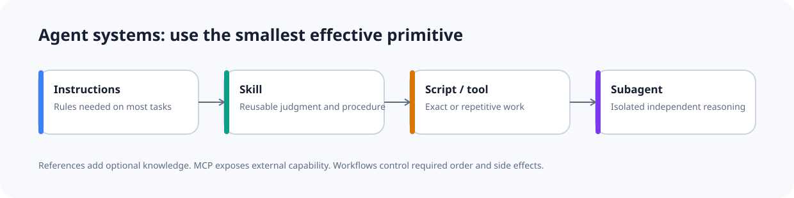
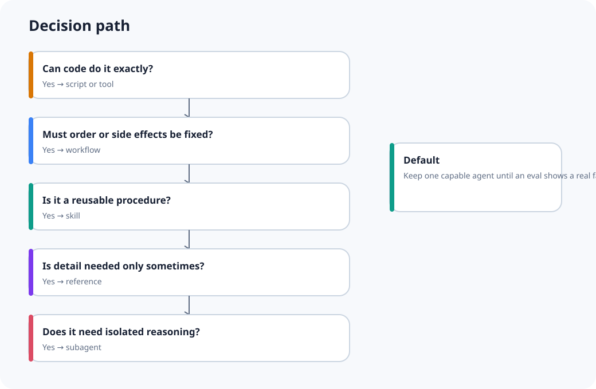

# Agent Systems Field Guide



A vendor-neutral, executable guide for deciding when to use instructions, skills, references, code, tools, MCP, hooks, workflows, subagents, and specialist agents.

> **Use the smallest primitive that fixes a measured failure.**

The repo combines plain-English architecture guidance with frozen labs, runnable examples, live harness adapters, source-backed claims, and fail-closed verification.

## The doctrine

```text
Start with one capable agent
            ↓
Observe a real failure
            ↓
Add the cheapest suitable boundary
            ↓
Run the same frozen evaluation
            ↓
Keep or revert
```

This avoids two common mistakes:

- putting every procedure into one permanent prompt;
- adding subagents because the diagram looks more advanced.

## Five-minute decision guide

| Need | Default | Main test |
|---|---|---|
| Rule needed on most tasks | Instructions | Would removing it harm most tasks? |
| Repeatable work that needs judgment | Skill | Does the model need to decide how? |
| Detailed knowledge needed only in some cases | Reference | Can the skill state exactly when to read it? |
| Exact or repetitive operation | Script or tool | Can code produce the right result reliably? |
| Shared remote capability or identity boundary | MCP | Is a protocol worth its operational cost? |
| Exact reaction to an event | Hook | Should it run without model discretion? |
| Required order, retry, approval, or side effect | Workflow | Must control flow be guaranteed? |
| Large independent reasoning task | Subagent | Does separate context or parallel work help? |
| Durable role with distinct tools or permissions | Specialist agent | Is this a real authority boundary? |



Read the [quick reference](docs/quick-reference.md) for review triggers and scorecards.

## The two questions people usually get wrong

### When should a skill wrap a script?

Wrap it when the model must decide **whether**, **when**, or **how** to run the script, then interpret the result.

```text
Skill chooses the operation
        ↓
Script performs exact work
        ↓
Skill interprets evidence
```

Do not add a skill that only says “run this command” unless discovery itself measurably helps.

### When should `SKILL.md` use references?

Move content into a reference when it is conditional, the skill can state a clear read rule, and loading it every time would add irrelevant context.

The Agent Skills specification recommends keeping `SKILL.md` under 500 lines and below about 5,000 tokens. Treat this as an upper bound, not a target.

## Proof, not vibes

Six controlled labs change one architecture variable at a time.

| Lab | Controlled change | Main committed result |
|---|---|---|
| Mega instructions | eager specialist rules → on demand | loaded estimate `344 → 84.3` |
| Tool overload | same six tools, clearer boundaries | routing `50.0% → 100%` |
| Mega skill | monolith → core + references | loaded estimate `270 → 87.25` |
| Overlapping skills | same six jobs, clearer descriptions | routing `37.5% → 95.8%` |
| Premature subagents | worker per step → selective isolation | modelled agents `9.3 → 1.2` |
| Eager context | full preload → progressive loading | total estimate `46,600 → 3,963` |


These are deterministic structural experiments with frozen fixtures and SHA-256 manifests. They are **not** presented as universal Claude, Codex, Gemini, or Copilot benchmarks.

Start with the [lab index](labs/README.md) and the [flagship routing walkthrough](docs/evaluation/flagship-lab.md).

## Realistic examples

The examples are not weather demos or one-call wrappers.

- [Production incident](examples/incident-response/README.md) — correlate gateway, application, database, and provider evidence without inventing an upstream root cause.
- [Large code migration](examples/code-migration/README.md) — separate safe codemods from semantic rewrites and rollout risk.
- [Authentication security review](examples/security-review/README.md) — run exact policy checks before open-ended security judgment.
- [Release engineering](examples/release-engineering/README.md) — calculate dependency propagation and publish order, then hand side effects to a workflow.

Each example has a frozen input, deterministic script, expected output, and a clear boundary between code and agent judgment.

## Repository map

```text
docs/          field guide, scorecards, evaluation and security
patterns/      recommended architecture patterns
anti-patterns/ failure modes and repair guidance
labs/          six frozen before/after structural experiments
evals/         provider-neutral trace schema and paired comparison
examples/      four runnable real-world examples
diagrams/      deterministic accessible SVGs
sources/       dated source and claim ledger
src/           CLI, validators, adapters, labs and exporters
tests/         unit, integration and drift tests
```

## Install and run

```bash
python -m venv .venv
. .venv/bin/activate
python -m pip install -e .

agent-guide check .
agent-guide lab run all --root .
```

Development verification:

```bash
python -m pip install -r requirements-dev.lock
python scripts/verify.py --profile core --report-dir reports
```

The release profile adds exact Ruff, Mypy, and `agnix@0.49.0` gates. Missing tools are failures, not skips.

```bash
python scripts/verify.py --profile release --report-dir reports/ci
```

GitHub Actions, Python quality tools, Node.js, and agnix are pinned. CI rejects floating `latest`, mutable action tags, and known silent-skip patterns.

## Live harness adapters

The repo includes bounded command builders, output parsers, and an explicit runner for Claude Code, Codex, and Gemini CLI.

Render without execution:

```bash
agent-guide adapter render claude-code "Route this case" --model EXACT_MODEL_ID
agent-guide adapter render codex "Route this case" --model EXACT_MODEL_ID
```

A provider starts only when `--execute` is supplied:

```bash
agent-guide adapter run codex "Route this case" \
  --model EXACT_MODEL_ID \
  --schema labs/04-overlapping-skills/adapter-contracts/output-schema.json \
  --output-dir runs/case-001 \
  --execute
```

The runner uses no shell, has a hard timeout, prefers read-only or plan-style defaults, stores raw artifacts, and hashes prompts in summary records.

No live provider score is committed because this build did not run a fixed-model benchmark. See the [live provider protocol](docs/evaluation/live-provider-protocol.md).

## Evidence model

Every external claim is classified as:

- **Official** — first-party product or vendor guidance;
- **Specification** — open format or protocol behaviour;
- **Research** — published evaluation evidence;
- **Heuristic** — a useful review trigger, not a law;
- **Measure** — something your workload must decide.

The dated [evidence ledger](sources/README.md) covers Agent Skills, Anthropic, OpenAI, GitHub, Microsoft, NVIDIA, MCP, Google OKF, Gemini CLI, Cursor, OWASP, and agnix.

## Read next

1. [Quick reference](docs/quick-reference.md)
2. [Mental model](docs/mental-model.md)
3. [Primitive guide](docs/primitives/index.md)
4. [Decomposition method](docs/decomposition/index.md)
5. [Evaluation method](docs/evaluation/index.md)
6. [Vendor matrix](docs/vendor-matrix.md)
7. [Limits](docs/limits.md)

## Status

Version `0.4.0` contains a complete structural proof suite and publication-ready field-guide content. The verification report records the checks actually executed for this release. Live model results remain intentionally separate.

Apache-2.0. See [LICENSE](LICENSE) and [NOTICE](NOTICE).
