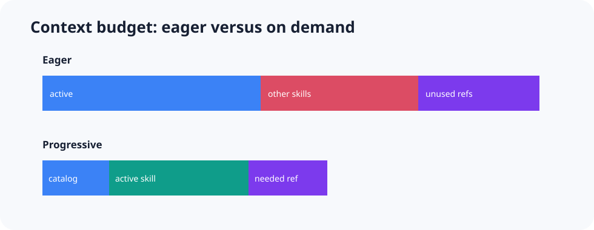

# Context budgeting

A large context window is capacity, not a reason to load everything.

## Track four layers

For each task, record:

1. **Catalogue context:** names, descriptions, and tool schemas used for discovery.
2. **Activated procedure:** instructions loaded after a skill or agent is selected.
3. **Conditional evidence:** references, retrieved documents, and tool results.
4. **Useful context:** the subset that materially supports the final decision.

The gap between loaded and useful context is waste.

## Useful metrics

- initial catalogue tokens;
- activated-skill tokens;
- reference tokens;
- tool-result tokens;
- relevant-token ratio;
- reference load rate;
- repeated evidence across agents;
- context truncation or compaction events;
- latency to first useful action.

Provider token counts are preferred for live runs. The repository's structural labs use a simple documented estimate and label it clearly.

## Common context failures

### Eager skill loading

A custom agent starts with every assigned skill injected in full. This can be valid for a small, tightly scoped set, but it should be measured. A large eager set removes the benefit of progressive disclosure.

### Reference hoarding

The skill reads all manuals “just in case.” Fix the read conditions and measure missed versus unnecessary reads.

### Raw tool dumps

A tool returns thousands of rows when a script could summarize the exact evidence needed.

### Duplicate subagent retrieval

Several workers fetch the same files, commits, or records because the parent did not share a compact evidence package.

### Permanent incident history

A long session keeps stale hypotheses and old logs after the task has changed. Use explicit summaries, evidence IDs, or a fresh worker context.

## Reduce context without losing evidence

- keep global rules short;
- improve catalogue descriptions;
- load one focused reference at a time;
- summarize deterministic data in code;
- pass evidence IDs rather than full raw records;
- give workers bounded inputs and outputs;
- store raw artifacts outside the model context;
- keep a trace so compacting context does not erase provenance.

## The goal

The goal is not the smallest token count. It is the smallest context that preserves task success, safety, and auditability.

**Evidence:** `progressive-disclosure`, `copilot-eager-skills`, `scripts-for-determinism`
