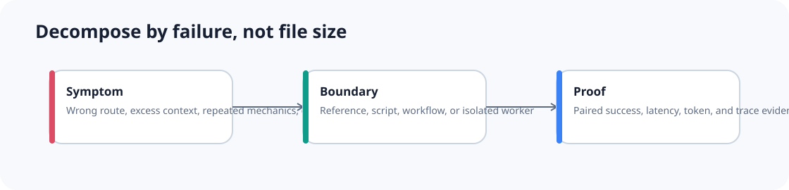
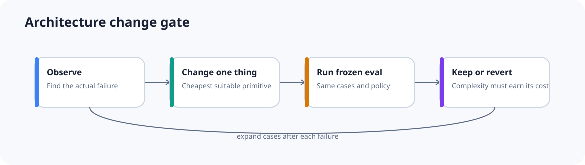

# Decomposition method

Do not ask, “How many skills are too many?” Ask, “Where is the measured failure?”

## Step 1 — Observe the current system

Capture representative traces before changing the architecture.

Look for:

- the wrong skill, tool, or agent selected;
- several catalogue items receiving similar scores;
- task-specific rules loaded on unrelated work;
- large references read without a matching condition;
- repeated filtering, joins, parsing, or counting;
- one worker retrieving data another worker already fetched;
- serial work that is genuinely independent;
- a worker returning a trivial deterministic value;
- side effects controlled only by prose;
- retries repeating completed actions;
- missing evidence hidden by a confident answer.

Write the failure in one sentence.

Good:

> Authentication prompts activate both the general security-review skill and the dependency-scan skill in 31% of frozen cases.

Weak:

> The agent setup feels too large.

## Step 2 — Identify the responsibility that is blurred

Map the failure to the smallest likely boundary.

| Observed failure | First change to test |
|---|---|
| task-specific rules are always loaded | move them from instructions into a skill |
| one skill contains large conditional manuals | keep the core method and add references |
| the model repeats exact work | add a script or batch tool |
| several callers need one remote capability | test an MCP boundary |
| one event must trigger the same rule | add a hook |
| order, approval, retry, or side effects are uncontrolled | add a workflow |
| a large independent investigation pollutes the parent | test one subagent |
| a durable domain needs separate tools or permissions | add a specialist agent |

Do not jump directly from a large instruction file to a fleet of agents. Try the cheapest boundary first.

## Step 3 — Freeze the comparison

Keep these fixed:

- case IDs and inputs;
- source-data snapshot;
- model and model settings;
- tool permissions;
- timeout;
- acceptance policy;
- grader or scoring code;
- retry policy;
- number of runs per case.

Change one architecture variable. For example, keep six skills and rewrite only their descriptions. That is the controlled change in [Lab 04](../../labs/04-overlapping-skills/README.md).

## Step 4 — Measure quality and cost

Use task-specific quality first. Then include:

- routing accuracy;
- false activation and missed activation;
- context loaded;
- relevant-context ratio;
- tool calls;
- total and wall-clock latency;
- input and output tokens;
- subagent count;
- retries;
- human intervention;
- side-effect errors;
- safety or permission failures.

A change can improve one metric and still be a bad trade. For example, ten parallel workers may reduce wall-clock time while tripling token cost and increasing contradictory outputs.

## Step 5 — Keep or revert

Keep the new boundary when it fixes the target failure without creating an unacceptable regression. Record the decision and the exact cases used.

Revert when:

- quality does not improve;
- the benefit is smaller than measurement noise;
- cost rises beyond the agreed budget;
- the change moves failures instead of fixing them;
- the system becomes harder to inspect or recover;
- the result depends on an unfair comparison.

## Practical review triggers

These numbers are review prompts unless marked as specification guidance.

| Trigger | Meaning |
|---|---|
| `AGENTS.md` above roughly 150–200 lines | inspect for task-specific sections |
| `SKILL.md` above roughly 300 lines | inspect for independently triggered branches |
| `SKILL.md` near 500 lines or 5,000 tokens | specification guidance says to move detail out |
| more than three plausible matches for common prompts | run a routing-overlap eval |
| a reference loaded on more than about 80% of runs | move essential rules upward |
| the same mechanical loop repeated three or more times | test code or batching |
| a subagent returns one small deterministic value | remove it unless isolation itself is required |
| a workflow step has a side effect but no idempotency key | block release until retry behaviour is explicit |

The trigger starts an investigation. It does not decide the architecture.

## Use the scorecards

The [decomposition scorecards](scorecards.md) turn the same method into short review questions for skills, references, scripts, workflows, and subagents.

**Evidence:** `start-single-agent`, `overlap-not-count`, `skill-size-guidance`, `skill-lift-eval`, `skill-v-workflow`
