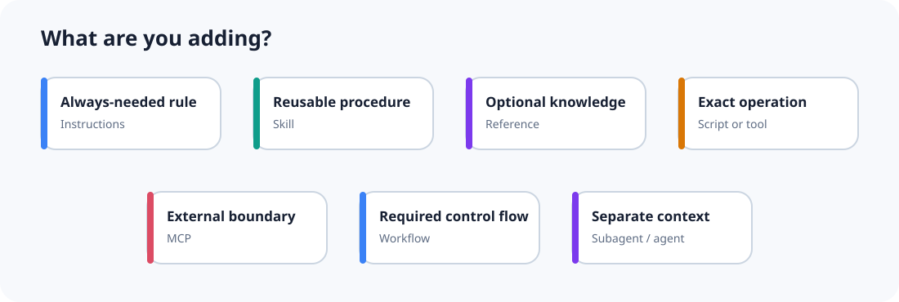

# Primitive guide



A primitive is a basic architecture building block. Pick one based on the problem it owns, not based on what a vendor calls it.

| Primitive | Owns | Does not own |
|---|---|---|
| [Instructions](instructions.md) | rules needed on most tasks | specialist procedures |
| [Skill](skills.md) | reusable judgment and procedure | large conditional manuals |
| [Reference](references.md) | optional specialist knowledge | control flow |
| [Script or tool](scripts-tools.md) | exact action or calculation | open-ended judgment |
| [MCP](mcp.md) | reusable external capability protocol | every local helper |
| [Hook](hooks.md) | exact event reaction | broad planning |
| [Workflow](workflows.md) | ordered control, checkpoints, retries, and side effects | flexible expert method |
| [Subagent](subagents.md) | isolated independent reasoning | trivial function calls |
| [Specialist agent](specialist-agents.md) | durable role, tools, permissions, or model policy | cosmetic personas |

## Composition is normal

A useful feature often uses several primitives:

```text
Skill
  ├─ reads one reference when a condition matches
  ├─ calls a script for exact data reduction
  └─ returns evidence to a workflow step
```

The question is not “which single primitive wins?” The question is “which primitive should own each responsibility?”

## Three boundary checks

Before adding anything, answer:

1. **Activation:** what exact user intent or system event activates it?
2. **Responsibility:** what evidence, action, or decision does it own?
3. **Exit:** what compact result does it return, and what does it explicitly not do?

If the boundary cannot be explained in one or two sentences, it is probably too broad or overlaps another component.

## Start here

- Use the [quick reference](../quick-reference.md) for a fast decision.
- Use the [decomposition method](../decomposition/index.md) when a current design is failing.
- Use the [evaluation method](../evaluation/index.md) before accepting extra complexity.
