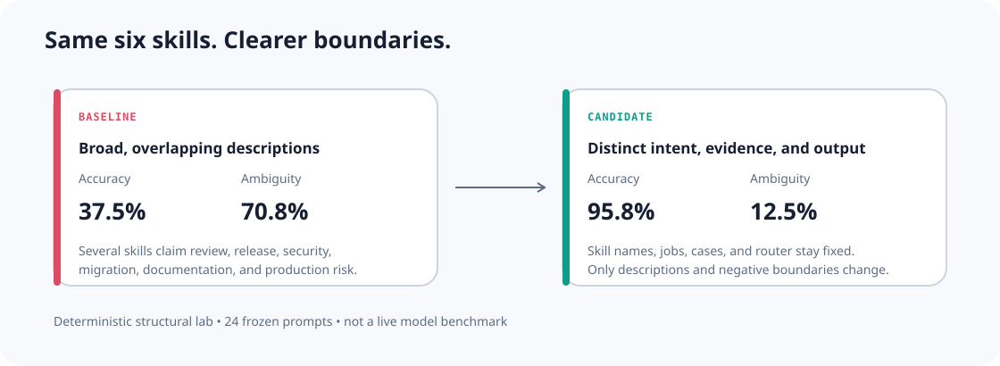

# Lab 04 — Overlapping skills

## Question

How do overlapping skill descriptions affect discovery when skill count and capability stay constant?

## Controlled change

Both variants contain the same six skill names and the same six jobs.

- **Baseline:** every description starts with broad review language and lists several neighbouring domains.
- **Candidate:** each description owns a distinct user intent, evidence set, and output.

Twenty-four frozen prompts run through the same deterministic catalogue router.



## Result

| Metric | Baseline | Candidate |
|---|---:|---:|
| top-1 accuracy | 0.375 | 0.958 |
| ambiguity rate | 0.708 | 0.125 |
| mean pairwise overlap | 0.377 | 0.021 |
| maximum pairwise overlap | 0.600 | 0.120 |
| mean decision margin | 0.592 | 3.840 |

## Two live harness contracts

The repository includes bounded command builders and parsers for:

- Claude Code non-interactive mode;
- Codex non-interactive mode.

`adapter-contracts/` contains frozen output fixtures and one shared schema. They verify parsing and command contracts in CI. They are **not** live benchmark results.

Render without execution:

```bash
agent-guide adapter render claude-code "Select the best skill for this task" \
  --schema labs/04-overlapping-skills/adapter-contracts/output-schema.json

agent-guide adapter render codex "Select the best skill for this task" \
  --schema labs/04-overlapping-skills/adapter-contracts/output-schema.json
```

## Run

```bash
agent-guide lab run 04-overlapping-skills --root .
```

## Limits

The committed result is a structural routing simulation. A provider-specific claim requires repeated fixed-model runs with stored traces, configuration, cost, and date.
